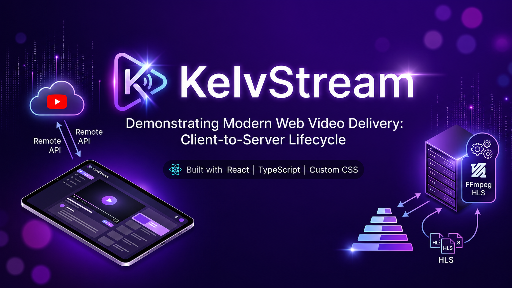

# KelvStream – FAANG-Grade Adaptive Bitrate Streaming Platform

KelvStream is a premium, high-performance streaming application designed to demonstrate the client-to-server lifecycle of modern web video delivery. Built with React, TypeScript, and a custom CSS design system, KelvStream features a luxury dark purple/violet UI and integrates both remote YouTube v3 API media and local FFmpeg-transcoded HTTP Live Streaming (HLS) feeds.



---

## ⚡ Key Highlights & Architecture

### 1. Adaptive Bitrate Streaming (HLS)
Modern video-sharing platforms cannot deliver raw files directly to users. KelvStream features a live, local **HLS Transcoding Pipeline**:
- **Multiplexed Video Processing**: When a video is uploaded, a custom Express backend spawns an asynchronous child process using **FFmpeg**.
- **Stream Segmenting**: The raw media is split into 6-second `.ts` chunks and compiled into playlists for two distinct profiles:
  - **720p HD** (High quality, high bitrate)
  - **360p SD** (Standard quality, low bandwidth)
- **Master Manifest (`master.m3u8`)**: A master index acts as the entry point, allowing the ReactPlayer component to perform client-side **Adaptive Bitrate (ABR)** shifts, adjusting video quality dynamically as network speeds change.

### 2. Premium Design System
Instead of generic corporate designs, KelvStream implements a bespoke luxury UI:
- **Color Scheme**: Deep obsidian body (`#0a0a0f`) with ultraviolet (`#7c3aed`) and pink neon (`#c084fc`) gradients.
- **Glassmorphism**: Translucent navbars and sidebars with modern backing filters (`backdrop-filter: blur(20px)`).
- **Responsive Layout**: Designed for mobile and desktop viewports, using flex and grid models instead of strict framework boxes.
- **Micro-animations**: Interactive elements animate on hover, including play button overlay triggers, card translations, and pulsating pipeline loaders.

---

## 📂 Project Structure

```text
youtube-clone-main/
├── client/                 # React & TypeScript Frontend (Vite)
│   ├── src/
│   │   ├── components/     # UI Components (Navbar, Feed, VideoDetail, etc.)
│   │   └── utils/          # API services
│   └── public/             # Icons and static web assets
└── server/                 # Node.js + Express Backend
    ├── uploads/            # Temporary storage for raw video uploads
    └── transcoded/         # Transcoded HLS manifest playlists and chunks
```

---

## ⚙️ Getting Started

### Prerequisites
- **Node.js** (v16+ recommended)
- **Yarn** package manager
- **FFmpeg** installed on your system PATH.
  - *Windows*: Run `winget install Gyan.FFmpeg` or download from Gyan.dev and add the `bin` directory to your System Environment variables.
  - *Mac*: `brew install ffmpeg`

---

### Step 1: Running the Backend
1. Navigate to the server folder:
   ```bash
   cd server
   ```
2. Install server dependencies:
   ```bash
   npm install
   ```
3. Start the transcoding server:
   ```bash
   npm start
   ```
   *The server runs at `http://localhost:5000` where it hosts an automated **Transcoding Control Panel** to test raw video submissions.*

---

### Step 2: Running the Frontend Client
1. Navigate to the client folder:
   ```bash
   cd client
   ```
2. Install client packages using Yarn (to ensure lockfile integrity):
   ```bash
   yarn install
   ```
3. Add your RapidAPI key to `.env` inside `client/`:
   ```env
   VITE_REACT_APP_RAPID_API_KEY=b1f98c5952msh6763552ad8b8870p121a5bjsn03ec77f54c00
   ```
4. Start the frontend developer build:
   ```bash
   yarn dev
   ```
5. Open your browser and navigate to `http://localhost:5173`.

---

## 🛠️ Verification Steps
1. Open the local control panel at `http://localhost:5000`.
2. Select any `.mp4` video from your computer and upload it.
3. Once transcoding completes, open `http://localhost:5173`.
4. Your uploaded video will automatically appear at the top of the feed tagged with a `⚡ Local HLS` badge.
5. Click on the video to watch it play seamlessly, leveraging adaptive streaming segments directly from your local disk.
